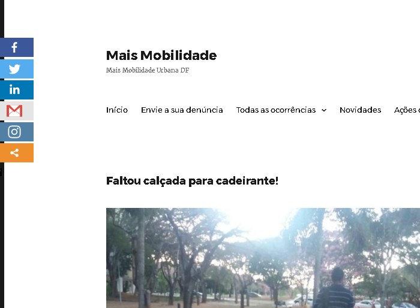
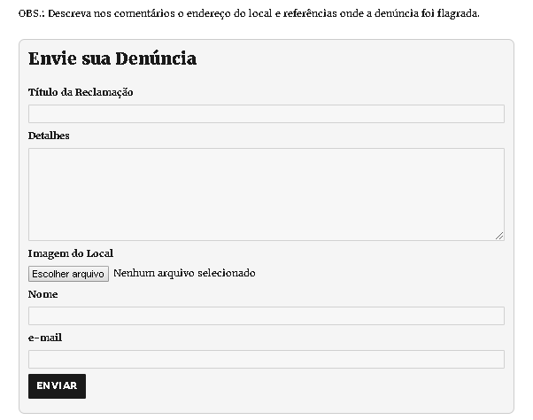
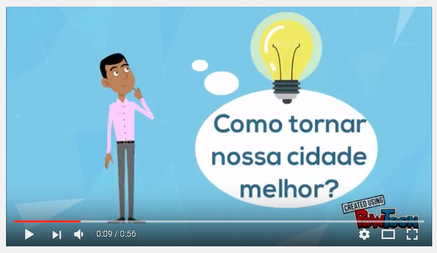

# maismobilidadeurbana
A proposta do sistema é permitir postar denúncias de problemas de mobilidade urbana. A ideia é dar visibilidade ao problema que hoje é sentido principalmente por pessoas que são portadoras de necessidades especiais, como: cadeirantes, deficientes visuais, entre outros. Essa proposta visa tanto pressionar as entidades públicas a agirem mais sobre essas questões, bem como permitir que em um futuro não muito distante seja possível ter alguma forma de patrocínio ou crowdfunding para levantar recursos para solucionar os problemas de mobilidade urbana.

## segue exemplo de tela com denúncia de problema de mobilidade urbana

## segue exemplo de tela para envio das denúncias de problemas de mobilidade urbana

# Público alvo e do problema a ser resolvido
O *público alvo* consiste em pessoas consideradas como Portadora de Necessidades Especiais (PNE) que abrangem:
- dificuldades de locomoção em diversos graus de restrição, como: cadeira de rodas, deficiências que reduzem a capacidade locomotora (uso de muletas/bengalas) comum em idosos.
- portadores de deficiência visual

*Problema a ser resolvido*: considerando a falta de envolvimento do setor público e privado na resolução de *problemas de mobilidade*, desde o projeto de instalações, bem como o legado existente de prédios antigos que não atendem os atuais requisitos de mobilidade, muitas vezes reclamar sobre esses problemas para os órgãos responsáveis costuma ser uma atividade onerosa que muitas vezes requer o deslocamento até o local, tempo de espera na fila, etc. Depois de finalmente fazer a denúncia, muitas vezes uma denúncia, ainda que relevante, se não for acompanhada de algum abaixo-assinado no momento da entrega da queixa, a espectativa de obter alguma resolução é praticamente mínima. Desta forma, o descaso quanto a estas questões tem sido um problema comum que traz enormes dificuldades e sofrimento para o *público* que cotidianamente sofre com o problema de mobilidade urbanana.

Por *probelmas de mobilidade*, podemos entender: 
- restrições de acesso que determinados prédios possuem, como: falta de rampa de acesso, falta de elevador, falta de corrimão adequado, escadas apertadas ou fora do padrão.
- problemas de circulação, como: falta de rebaixamento das calçadas, falta de guias para deficiente visual e obstáculos no chão ou na parede ou teto que oferecem riscos para a circulação de deficientes visuais.
 
# Descrição da solução concebida
A solução consiste no uso de um aplicativo desenvolvido em WordPress que possui uma tela de cadastro para registro de denúncias de problemas de mobilidade urbana, onde as pessoas podem publicar foto do problema, informar a localização e descrever em mais detalhes o problema e levantar discussões sobre o tema.

Um dos objetivos é apontar onde estão os problemas de mobilidade segundo o olhar crítico da comunidade local.

Após a publicação e organização das reclamações por região (atividade que será facilitada através do uso da ferramenta), é possível que entidades interessadas neste problemas, como ONGs e equivalentes (como a ICEP), bem como empresas que apostam no marketing social, poderão se mobilizar mais para resolverem os problemas relatados.

A busca por resolução do problema pode se dar tanto através da forma tradicional mais conhecida que é através do envio formal das queixas para as entidades públicas responsáveis, como também através do envolvimento da comunidade para o levantamento de recursos para atingir a solução dos problemas através de campanhas de crowdfunding.

# Descrição resumida da estratégia utilizada para promoção de engajamento:
A estratégia principal empregada para promoção e engajamento foi o compartilhamento do projeto nas redes sociais: facebook, twitter e grupos de whatsapp, bem como integração das postagens aprovadas no site são automaticamente postadas na página do ICEP Brasil no Facebook e Twitter
- https://www.facebook.com/IcepBrasil/
- https://twitter.com/ICEPBrasil

- *Requisição na página de mobilidade urbana do Wikipedia:* https://pt.wikipedia.org/wiki/Mobilidade_urbana
> pedido para acrescentar o site https://pt.wikipedia.org/wiki/Mobilidade_urbana

- *Mensagens de divulgação:*
## Mensagem 1
> Pessoal, segue um site que se propõe centralizar denúncias mobilidade urbana que estou apoiando. A ideia é dar visibilidade aos problemas que as pessoas encontram ao andarem pela cidade como cadeirantes, deficientes visuais, idosos e pais com carrinho de bebê.
> http://maismobilidadeurbana.com.br

## Mensagem 2
> Pessoal, já está no ar um site cuja proposta é permitir postar denúncias de problemas de mobilidade urbana. É uma espécie de "reclame aqui da mobilidade urbana". A ideia é dar visibilidade ao problema que hoje é sentido principalmente por pessoas que são portadoras de necessidades especiais, como: cadeirantes, deficientes visuais, entre outros.
Essa proposta visa tanto pressionar as entidades públicas a agirem mais sobre essas questões, bem como permitir que em um futuro não muito distante possamos ter alguma forma de patrocínio ou crowdfunding para levantar recursos para solucionar os problemas de mobilidade urbana. 
> Então... vamos! Comece a fazer sua parte! Denuncie compartilhe e se envolva!
> Para saber mais acesse: http://maismobilidadeurbana.com.br

OBS.:Todo o conteúdo a seguir está disponível na pasta [/divulgacao](divulgacao)

## Imagem de divulgação:

## Link de divulgação no Youtube

- O vídeo está disponível em [/divulgacao/video-divulgacao.mp4](divulgacao/video-divulgacao.mp4)

# Link para Google Analytics:
https://analytics.google.com/analytics/web/#embed/report-home/a102169992w149627374p154547058/

# Link do Trello para controle de atividades do projeto
https://trello.com/b/9m67A0dx/projeto-2-app-c%C3%ADvico-grupo-2

# Membros do grupo que participaram do projeto:
- Carla Gama Lustosa
- Diego Emanuel F. Da Rocha
- Fábio Barros Leal
- Haroldo Mendes
- Tarcizio Vieira Neto
